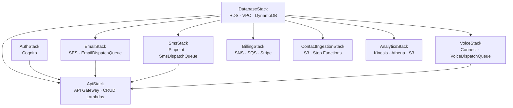

# MarketPro — AWS Multi-Channel Marketing Platform

> Architecture & Implementation Plan

---

## 1. Executive Summary

MarketPro is a multi-channel bulk marketing platform (Email, SMS, Voice) built entirely on native AWS services. The platform is designed to be highly scalable, cost-effective, and capable of handling millions of outbound messages while tracking granular engagement metrics and enforcing strict regulatory compliance (TCPA, CAN-SPAM, GDPR/CCPA).

The architecture revolves around a decoupled, serverless orchestration engine using SQS-driven dispatch queues, Amazon SES for email delivery, AWS End User Messaging / Pinpoint for SMS, Amazon Connect for voice dialing with AMD, and a Double-Entry Billing Ledger for usage tracking and reconciliation.

---

## 2. Core Service Mapping

| Component | AWS Service | Purpose |
|---|---|---|
| Frontend | Next.js on Amplify / S3 + CloudFront | React web application for the user portal |
| Authentication | Amazon Cognito | User login, MFA, RBAC, and workspace identity |
| API Layer | API Gateway + Lambda | Serverless REST backend with Lambda Authorizers |
| Primary Database | Amazon RDS (PostgreSQL) | Single System of Record for Contacts, Consent, Billing |
| Ephemeral State | Amazon DynamoDB | Idempotency keys, WebSocket state, Audit Logs |
| Contact Import | Amazon S3 + Step Functions | CSV uploads with chunked batch processing |
| Campaign Orchestration | SQS + Lambda | Per-channel dispatch queues with event-source mapping |
| Email Engine | Amazon SES | Domain auth (DKIM/SPF/DMARC), templates, raw sending |
| SMS Engine | AWS End User Messaging (Pinpoint) | 10DLC registration, number provisioning, outbound SMS |
| Voice Engine | Amazon Connect | Outbound dialing, AMD, IVR Contact Flows, Polly TTS |
| Analytics | Kinesis Firehose + Athena + QuickSight | Streaming events to S3 Data Lake, queried via Athena |
| Billing | Stripe + SQS + EventBridge | MRR subscriptions, usage-based pre-paid ledger |

---

## 3. Platform Modules

### Module A: Contact Management, Segmentation & State Minimization

- **Single System of Record**: Amazon RDS (PostgreSQL) is the sole persistent store for workspace configs, contact profiles, segments, consent, and billing. Campaign audiences are queried just-in-time during execution and injected into stateless SQS dispatch queues — never synced to secondary stores.
- **Multi-Channel Ingestion**:
  - *CSV Uploads*: Users upload via the frontend to S3. An S3 event triggers a Step Function that parses in chunks, sanitizes data, and loads into RDS.
  - *Bulk API*: The `/contacts/import` endpoint supports batch upserts with server-side validation and deduplication.
  - *API & Webhooks*: API Gateway endpoints for real-time CRM syncs.
- **Data Hygiene & Validation**:
  - *Duplicate Detection*: PostgreSQL UPSERT rules merge by phone/email.
  - *FTC/National DNC Scrubbing*: Users provide their FTC SAN; the platform automates 31-day rolling scrubs for safe harbor status.
  - *Pre-Send Verification*: Third-party email validation API flags risky addresses during import.
- **Consent Evidence System**:
  - *TCPA Consent Ledger*: Immutable ledger in RDS tracking Source, Timestamp, Disclosure Text version, Purpose, and Revocation Chain.
  - *GDPR/CCPA "Right to be Forgotten"*: Handled via the Data Retention Matrix (see Section 6B).

### Module B: Email Marketing

- **Domain & Deliverability**:
  - Core DKIM, SPF, and DMARC authentication via the SES API.
  - SES Managed Dedicated IPs with automatic warmup for high-volume senders.
  - Custom tracking subdomains (e.g., `link.userdomain.com`).
  - *Note*: The AWS account must be moved out of the SES sandbox before production launch.
- **Content & Personalization**:
  - Visual email builder at `/email-builder` (GrapesJS). HTML saved as SES Templates.
  - Image assets served globally via CloudFront.
  - Dynamic merge tags (`{{first_name}}`, `{{last_name}}`, `{{company}}`).
  - A/B split testing with auto-winner logic.
- **Compliance & The Gmail Blindspot**:
  - One-Click Unsubscribe (RFC 8058) headers on every outgoing email.
  - Google Postmaster Tools integration for aggregate domain health monitoring.
  - Engagement Sunsetting: auto-suppress Gmail recipients inactive for 6+ months.

### Module C: SMS Marketing (AWS End User Messaging)

- **Telephony Asset Lifecycle**:
  - Number provisioning via AWS End User Messaging API, mapped to `workspace_id` in RDS.
  - Omnichannel sharing: numbers associated with the Amazon Connect instance for unified Caller ID.
  - 10DLC registration and Toll-Free Verification flows with async approval handling.
- **Content & Personalization**:
  - Encoding-aware composer: GSM-7 at 160 chars (153 multipart) vs. Unicode/UCS-2 at 70 chars (67 multipart) with real-time segment recalculation.
  - Custom URL shortener (`txt.brand.com/xY7z`) via API Gateway + DynamoDB for click tracking.
- **Scheduling & Compliance**:
  - Waterfall Timezone Resolution Engine: (1) Explicit CRM data → (2) HLR/CNAM carrier lookup → (3) NPA area code fallback with safety buffer.
  - 10DLC TPS rate limiting via ElastiCache (Redis) Token Bucket inside dispatch Lambdas.
  - Two-Way Messaging: Inbound routed to SNS Topic; Lambda handles STOP/HELP keywords automatically.

### Module D: Voice Calling (Amazon Connect)

- **Pooled Connect Instance**: Single shared instance to avoid AWS account limits. Logical tenant isolation via dedicated Routing Profiles, Queues, and `workspace_id` Contact Attributes.
- **Contact Flows & IVR**: Users compose SSML scripts in the UI. The dispatch Lambda injects workspace-specific scripts and Polly voice settings as Contact Attributes into the Connect flow.
- **Answering Machine Detection (AMD)**: Native Connect AMD with configurable voicemail drop and graceful disconnect.
- **Number Reputation**: Verifiable Regional Presence (no neighbor spoofing), STIR/SHAKEN A-Level attestation, and registration with carrier analytics databases (FreeCallerRegistry, First Orion, Hiya).

### Module E: Multi-Brand Workspace Management (Agency Mode)

- **Tenant Isolation**: All data siloed by `workspace_id` foreign keys in PostgreSQL. SES VDM tags with `tenant_id` for per-workspace deliverability metrics. Connect CTRs partitioned by `workspace_id`.
- **RBAC**: A single Cognito user can hold different permission levels (owner, admin, editor, viewer) across multiple workspaces.

### Module F: Billing, Accounting & Immutable Ledger

- **SaaS Subscription (MRR)**: Monthly platform fee via Stripe Billing.
- **Double-Entry Pre-Paid Ledger**: PostgreSQL-backed ledger with `account_balances` and `transactions_ledger` tables. Authorization holds placed at campaign schedule time; captured or refunded upon delivery receipt.
- **Idempotent Event Processing**: Delivery/bounce/failure events published to a central SNS Topic → SQS Billing Queue → Lambda consumer. DynamoDB Idempotency Store (7-day TTL) prevents double-charging.
- **Nightly Reconciliation**: EventBridge cron sweeps stale authorizations (>72 hours without delivery receipt) and auto-refunds.
- **Auto-Recharge**: Stripe charge triggered when available balance falls below threshold.

### Module G: Super Admin & Support

- **Super Admin**: Separate Cognito Group for internal employees.
- **Zero-Trust Impersonation**: Step-up MFA, reason code (ticket ID), 15-minute JWT, immutable DynamoDB audit log.
- **Global Kill Switches**: Instantly pause a workspace's SES/SQS/Connect dispatch.

---

## 4. Data Pipelines

### A. Data Ingestion & Hygiene Pipeline

1. **Upload**: User uploads CSV to S3 via `ImportWizard.tsx` or the `/contacts/import` bulk API.
2. **Orchestration**: Step Functions process chunks via Lambda (`csv-parser.ts`, `csv-upload-trigger.ts`).
3. **Validation**: Scrubbed against FTC DNC registries, deduplicated via PostgreSQL UPSERT.
4. **Storage**: Clean records persisted to RDS (Single System of Record).

### B. Campaign Orchestration & Dispatch Pipeline

1. **Trigger**: User creates a campaign via `POST /campaigns`. The `campaigns.ts` Lambda detects the channel and pushes a message to the corresponding SQS dispatch queue.
2. **Queue Routing**:
   - Email → `EmailDispatchQueue` → `dispatch-email.ts`
   - SMS → `SmsDispatchQueue` → `dispatch-sms.ts`
   - Voice → `VoiceDispatchQueue` → `dispatch-voice.ts`
3. **Dispatch**: Each Lambda fetches the campaign, template, and segment contacts from RDS. It performs merge-tag replacement and calls the appropriate AWS API (SES `SendEmailCommand`, Pinpoint `SendMessagesCommand`, or Connect `StartOutboundVoiceContactCommand`).
4. **Logging**: Per-recipient results are written to the `campaign_messages` table for audit and analytics.

### C. Inbound Interaction Pipeline (Two-Way)

1. **Inbound Event**: Carrier routes reply to AWS → SNS / Connect.
2. **Processing**: Lambda resolves `workspace_id`, logs the reply to `sms_inbox` / `email_inbox`, and processes STOP flags into the Consent Revocation Chain.

### D. Telemetry, Billing & Reconciliation Pipeline

1. **Event Generation**: SES/Pinpoint/Connect emit delivery status events.
2. **Canonical Event Bus**: Events published to a central SNS Topic (fan-out).
3. **Cold Storage & Analytics**: SNS → Kinesis Firehose → S3 Data Lake (queried by Athena).
4. **Idempotent Billing Capture**: SNS → SQS Billing Queue → Lambda checks DynamoDB idempotency store → executes CAPTURE or REFUND in the RDS ledger.
5. **Nightly Reconciliation**: EventBridge cron sweeps stale authorizations and executes account true-ups.

---

## 5. Guardrails & Compliance

### A. State Minimization & Guardrails

- **Idempotency**: Transactional state in PostgreSQL; DynamoDB strictly for ephemeral TTL storage. All event-driven functions designed to be fully idempotent.
- **Multi-Workspace Isolation**: Lambda Authorizer validates JWT, verifies workspace access, and injects `workspace_id` into execution context for RDS row-level filtering.
- **Deliverability Guardrails**:
  - Bounce rates: warn at 2%, pause at 4%.
  - Complaint rates: warn at 0.08%, pause at 0.4%.

### B. Data Retention & Anonymization Matrix (GDPR / TCPA Conflict Resolution)

When a contact exercises their "Right to be Forgotten":

| Data Category | Action | Retention |
|---|---|---|
| **Operational Data** (RDS Profiles) | Hard deleted | Immediate |
| **Consent & Suppression Ledger** | PII SHA-256 hashed; hash retained on Suppression List | 4 years (TCPA statute of limitations) |
| **Billing Ledger** | PII stripped; transaction records retained | 7 years (IRS/accounting) |
| **Analytics Event Trails** (S3 Data Lake) | PII Tokenized with internal UUIDs; deleting UUID mapping in RDS instantly anonymizes | Indefinite (anonymized) |

---

## 6. Codebase Structure

```
Marketing-SaaS2/
├── apps/
│   ├── frontend/                    # Next.js 16 (Turbopack)
│   │   └── app/
│   │       ├── contacts/            # CRM table, ImportWizard
│   │       ├── email-builder/       # Visual HTML email editor
│   │       ├── templates/           # Email, SMS, Voice, WebForm template management
│   │       ├── campaigns/           # Campaign creation & scheduling
│   │       ├── segments/            # Audience segment management
│   │       ├── inbox/               # SMS & Email inbox (two-way)
│   │       ├── analytics/           # Reporting dashboard
│   │       ├── settings/            # Workspace settings & compliance
│   │       ├── login/               # Auth flow
│   │       ├── components/          # Shared UI components (Modal, FormField, etc.)
│   │       └── lib/
│   │           ├── store.ts         # Global state management (useStore)
│   │           └── api.ts           # API client
│   │
│   └── infrastructure/              # AWS CDK (TypeScript)
│       ├── bin/
│       │   └── infrastructure.ts    # Stack orchestration entry point
│       ├── lib/
│       │   ├── database-stack.ts    # RDS, VPC, DynamoDB idempotency table
│       │   ├── auth-stack.ts        # Cognito User Pool & Identity Pool
│       │   ├── api-stack.ts         # API Gateway, all CRUD Lambdas, Authorizer
│       │   ├── email-stack.ts       # SES Identities + EmailDispatchQueue + dispatch Lambda
│       │   ├── sms-stack.ts         # Pinpoint App + SmsDispatchQueue + dispatch Lambda
│       │   ├── voice-stack.ts       # Connect Instance + VoiceDispatchQueue + dispatch Lambda
│       │   ├── billing-stack.ts     # SNS Canonical Bus, SQS Billing Queue, Stripe Webhook
│       │   ├── contact-ingestion-stack.ts  # S3 Upload Bucket + Step Functions
│       │   └── analytics-stack.ts   # Kinesis Firehose, Athena, S3 Data Lake
│       ├── lambda/
│       │   ├── api/                 # CRUD handlers: contacts, templates, campaigns, etc.
│       │   ├── dispatch/            # Async dispatch: dispatch-email, dispatch-sms, dispatch-voice
│       │   ├── authorizer.ts        # JWT validation + workspace RBAC
│       │   ├── csv-parser.ts        # Step Function chunk processor
│       │   ├── stripe-webhook.ts    # Stripe event handler → RDS ledger
│       │   ├── idempotent-billing-capture.ts  # SNS → SQS billing consumer
│       │   ├── right-to-be-forgotten.ts       # GDPR deletion orchestrator
│       │   └── timezone-resolution.ts         # Waterfall timezone engine
│       └── drizzle/
│           └── schema.ts            # 22-table PostgreSQL schema (Drizzle ORM)
│
└── turbo.json                       # Turborepo build orchestration
```

---

## 7. Database Schema Overview (22 Tables)

| # | Table | Purpose |
|---|---|---|
| 1 | `workspaces` | Multi-tenant workspace definitions |
| 2 | `account_balances` | Double-entry balance cache per workspace |
| 3 | `transactions_ledger` | Immutable financial log (AUTH / CAPTURE / REFUND / DEPOSIT) |
| 4 | `users_workspaces` | RBAC: user ↔ workspace ↔ role mapping |
| 5 | `contacts` | Contact profiles with custom fields (JSONB) |
| 6 | `segments` | Named audience segments |
| 7 | `contact_segment` | Many-to-many contact ↔ segment membership |
| 8 | `email_templates` | HTML email templates with editor JSON |
| 9 | `sms_templates` | SMS message templates with encoding metadata |
| 10 | `call_scripts` | SSML voice scripts with Polly voice selection |
| 11 | `campaigns` | Campaign definitions (channel, template, segment, schedule) |
| 12 | `campaign_messages` | Per-recipient send results and engagement tracking |
| 13 | `sms_inbox` | Inbound SMS messages with keyword detection |
| 14 | `consent_ledger` | Immutable TCPA consent evidence chain |
| 15 | `suppression_list` | SHA-256 hashed PII for permanent suppression |
| 16 | `workspace_settings` | Channel config, compliance info, DNC settings |
| 17 | `segment_folders` | Organizational folders for segments |
| 18 | `template_folders` | Organizational folders for templates |
| 19 | `web_forms` | Embeddable lead capture form definitions |
| 20 | `custom_field_definitions` | Workspace-level custom contact field schemas |
| 21 | `email_inbox` | Inbound email messages |
| 22 | `form_submissions` | Web form submission data with contact linking |

---

## 8. CDK Stack Dependency Graph



---

## 9. Implementation Roadmap

### Phase 1: Foundation, Workspaces & Contact Management ✅
- Provision VPCs, Cognito, API Gateway, and PostgreSQL (RDS).
- Build Workspace switching architecture, Lambda Authorizers, and Support Impersonation Audit Logs.
- Implement the Double-Entry Accounting schema in RDS and DynamoDB idempotency tables.
- **Contact Ingestion Pipeline**: `/contacts/import` bulk endpoint and Step Functions chunking for CSV uploads.
- **Contact Management UI**: `ImportWizard.tsx` and CRM table view with pagination and filtering.

### Phase 2: Email Engine ✅
- Integrate Amazon SES with domain auth (DKIM/SPF/DMARC) and VDM.
- Deploy CloudFront for image asset hosting.
- **Email Builder UI**: Visual editor at `/email-builder` for HTML templates.
- **Email Dispatch Pipeline**: `EmailDispatchQueue` (SQS) in `email-stack.ts` → `dispatch-email.ts` Lambda parses segment contacts, replaces merge tags, and sends via SES `SendEmailCommand`. Campaign API pushes new email campaigns to the queue.

### Phase 3: SMS Engine ✅
- Integrate AWS End User Messaging for phone numbers and 10DLC registration.
- Build the Waterfall Timezone Resolution Engine and FTC SAN 31-day scrubbing logic.
- Implement the SNS → SQS fan-out architecture for asynchronous billing capture.
- **SMS Template UI**: Composer integrated into `templates/page.tsx` with GSM-7/Unicode segment calculation.
- **SMS Dispatch Pipeline**: `SmsDispatchQueue` (SQS) in `sms-stack.ts` → `dispatch-sms.ts` Lambda sends via Pinpoint `SendMessagesCommand`.

### Phase 4: Voice Engine ✅
- Provision the pooled Amazon Connect instance with dynamic Contact Flows for IVR.
- Associate End User Messaging numbers to Connect for unified Caller ID.
- Integrate Connect Outbound Campaigns for dialing and AMD.
- **Voice Script UI**: SSML editor modal in `templates/page.tsx` with AWS Polly voice selection (Joanna, Matthew, Salli, Joey).
- **Voice Dispatch Pipeline**: `VoiceDispatchQueue` (SQS) in `voice-stack.ts` → `dispatch-voice.ts` Lambda calls Connect `StartOutboundVoiceContactCommand`.

### Phase 5: Analytics, Compliance & Beta Launch
- Complete Athena/QuickSight integration with PII Tokenization and `workspace_id` filtering.
- Build the automated "Right to be Forgotten" orchestrator based on the Data Retention Matrix.
- Implement STIR/SHAKEN registration and third-party analytics registry for spam label mitigation.
- Security audits, WAF tuning, and private beta rollout.

---

*Last updated: April 29, 2026*
